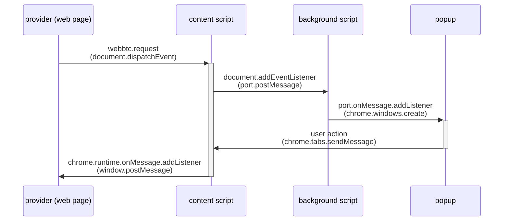

# webbtc-extension

`npm install`
`npm run dev`

### Chrome Extension Developer Mode

`1)` set your Chrome browser to `Developer mode`

`2)` click `Load unpacked`, and add the generated `./build` folder

### Sequence Diagram

### Packing

`npm build` + [Official Chrome WebStore Guide](https://developer.chrome.com/webstore/publish)
